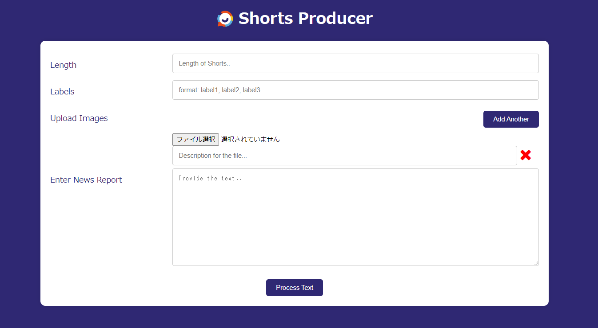
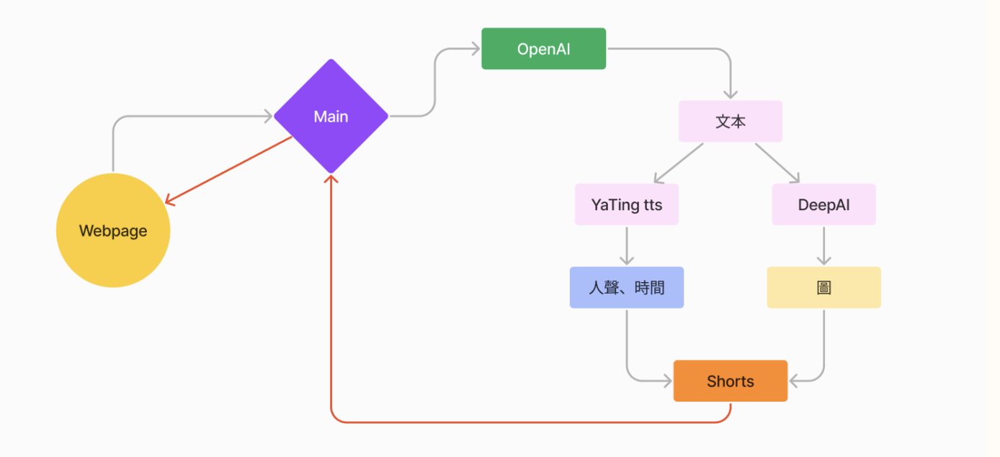

# ETTODAY_Shorts_Generator



## Introduction

This is a project that we implement the system that can let the user provide some contents and pictures, \
then this system can make a "shorts" video that is relative to this topic with just one click.


## How to install dependencies

Use `pip install -r requirement.txt` to install those dependencies.

```
Yating-TTS-SDK==0.1.2
pydub==0.25.1
aiohttp==3.8.6 
aiosignal==1.3.1 
async-timeout==4.0.3 
frozenlist==1.4.0 
multidict==6.0.4 
openai==0.28.1 
yarl==1.9.2
requests==2.26.0
waitress==2.1.2
flask==3.0.0
opencv-python==4.8.0.76
moviepy==1.0.3
numpy==1.24.1
Pillow==9.4.0
```
You also need to install `ffmpeg` to edit audio (pydub relies on it):

```
sudo apt-get update && apt-get upgrade
```
```
sudo apt-get install ffmpeg
```
## How to use
We wrote a simple front-end webpage for user to input their data.



Use the following command to start the webpage server:
```
python3 webpage.py
```
After the webpage is built, then you can visit the webpage by clicking the link below (in the terminal).
## What APIs do we use
We use serveral APIs to complete this project. Including OpenAI, Yating TTS, and DeepAI.

In order to use their service, you need to fill up their APIs in the following position:

#### Yating TTS: `audio.py line 13`
#### OpenAI: `image.py line 18` and  `script.py line 166`
#### DeepAI: `image.py line 40`

## Figma demo
Here is the link to the figma of how we think their APP should be redesigned into.
- [Link to figma](https://www.figma.com/proto/HLK0GkoBXcb1TxgsVoSn7R/ETtoday---draft3?type=design&node-id=0-1&scaling=scale-down&page-id=0%3A1&starting-point-node-id=210%3A193&show-proto-sidebar=1)
## Structure of this project
- `/demo`
    - The resources for demoing
    - There are demo result (`result.mp4`), some images on this readme, and a slides used in our represetation (`slides.pdf`)
- `/templates`
    - The templates of the webpage that the user will see
- `/static`
    - The images and css to be accessed by webpage
- `/uploaded_images`
    - The folder to store the images that user uploaded 
    - Automatically generated by `webpage.py`
- `/bgm`
    - The bgm list
- `/effect`
    - The sound effect list
- `/audio_result`
    - Store generated audio result
- `webpage.py`
    - The interface that the user (news editor) will see
- `main.py`
    - The entrance into our system, will finally generate a "shorts" video
- `audio.py`
    - Functions that will generate audio, we implement multi-threading technique here
    - `audio_generator(sentences, gerne, singleThread)`
    - `bgm_generator(gerne, length)`
- `script.py`
    - The function that will generate the script for TTS
    - `script_generator(text, length, imgsDescription)`
- `image.py`
    - The funtions that will generate image
    - `get_img(imgDescription)`
    - `picture_generator(imageDescription)`
- `video.py`
    - The functions that help us generate video
    - Called by `main.py`

## Contributor
- 吳冠霆 WU KUAN TING
- 廖幃萱 LIAO WEI XUAN
- 賴姿紜 LAI ZI YUN
- 林亞葶 LIN YA TING
- 鐘萱容 ZHONG XUAN RUNG